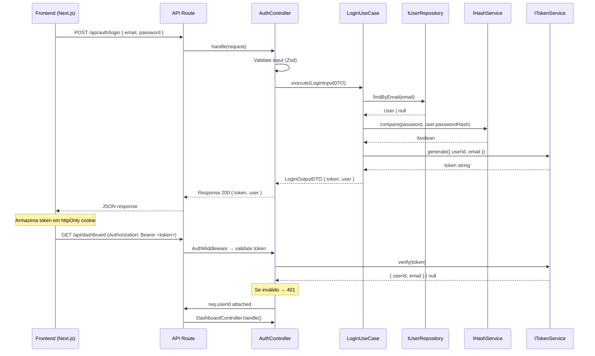
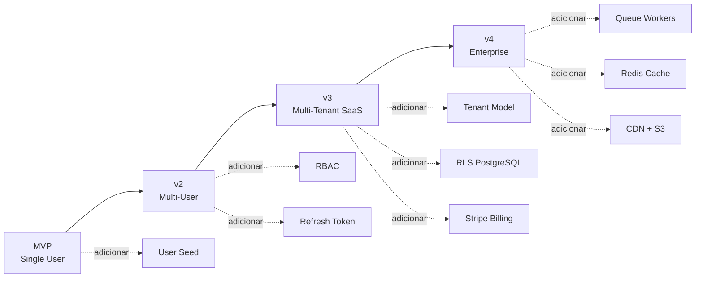

# 🏗 Plano Técnico de Implementação — PrintControl

Sistema de controle financeiro para gráfica caseira, arquitetado com Clean Architecture real, preparado para evolução SaaS multi-tenant.

---

## 1. Stack Tecnológica Definitiva

| Camada        | Tecnologia                                           | Justificativa                                    |
| ------------- | ---------------------------------------------------- | ------------------------------------------------ |
| **Runtime**   | Node.js 20 LTS + TypeScript 5.x                      | Tipagem forte, ecossistema maduro                |
| **Backend**   | API Routes do Next.js (ou standalone Express futuro) | Simplicidade no MVP, desacoplável via Clean Arch |
| **Frontend**  | Next.js 14 (App Router) + Tailwind CSS               | SSR, performance, DX                             |
| **ORM**       | Prisma (apenas na camada infra)                      | Type-safe, migrations                            |
| **Banco**     | PostgreSQL (Neon/Supabase)                           | Robusto, escalável, baixo custo                  |
| **Auth**      | JWT (access + refresh tokens) + bcrypt               | Stateless, substituível                          |
| **Gráficos**  | Recharts                                             | Leve, React-native                               |
| **Testes**    | Vitest + Testing Library                             | Rápido, compatível TS                            |
| **DI**        | tsyringe                                             | Inversão de dependência explícita                |
| **Validação** | Zod                                                  | Schema validation nos DTOs                       |
| **Deploy**    | Vercel (front) + Railway/Render (API)                | Custo baixo                                      |

---

## 2. Estrutura de Pastas Definitiva

```
print-control/
├── prisma/
│   └── schema.prisma
│
├── src/
│   ├── domain/                          # 🟢 NÚCLEO — zero dependências externas
│   │   ├── entities/
│   │   │   ├── User.ts
│   │   │   ├── Revenue.ts
│   │   │   ├── Expense.ts
│   │   │   └── Investment.ts
│   │   ├── enums/
│   │   │   ├── RevenueType.ts           # OWN | OUTSOURCED
│   │   │   ├── ExpenseType.ts           # OPERATIONAL | OUTSOURCED
│   │   │   ├── ExpenseCategory.ts       # SUPPLIES | MAINTENANCE | ENERGY | OUTSOURCING | OTHER
│   │   │   └── InvestmentType.ts        # EQUIPMENT | STRUCTURE | OTHER
│   │   ├── value-objects/
│   │   │   ├── Money.ts
│   │   │   ├── Email.ts
│   │   │   └── DateRange.ts
│   │   ├── repositories/               # Interfaces (contratos)
│   │   │   ├── IUserRepository.ts
│   │   │   ├── IRevenueRepository.ts
│   │   │   ├── IExpenseRepository.ts
│   │   │   └── IInvestmentRepository.ts
│   │   └── errors/
│   │       ├── DomainError.ts
│   │       ├── InvalidEmailError.ts
│   │       ├── InvalidMoneyError.ts
│   │       └── EntityNotFoundError.ts
│   │
│   ├── application/                     # 🟡 ORQUESTRAÇÃO — depende só de interfaces
│   │   ├── use-cases/
│   │   │   ├── auth/
│   │   │   │   ├── LoginUseCase.ts
│   │   │   │   └── ValidateTokenUseCase.ts
│   │   │   ├── revenue/
│   │   │   │   ├── CreateRevenueUseCase.ts
│   │   │   │   ├── ListRevenuesByPeriodUseCase.ts
│   │   │   │   ├── CalculateRevenueProfitUseCase.ts
│   │   │   │   └── LinkRevenueToExpenseUseCase.ts
│   │   │   ├── expense/
│   │   │   │   ├── CreateExpenseUseCase.ts
│   │   │   │   ├── ListExpensesByPeriodUseCase.ts
│   │   │   │   └── GetTotalExpenseUseCase.ts
│   │   │   ├── investment/
│   │   │   │   ├── CreateInvestmentUseCase.ts
│   │   │   │   ├── GetTotalInvestmentUseCase.ts
│   │   │   │   └── ListInvestmentsByPeriodUseCase.ts
│   │   │   ├── dashboard/
│   │   │   │   └── GenerateDashboardUseCase.ts
│   │   │   ├── cashflow/
│   │   │   │   └── GenerateCashFlowUseCase.ts
│   │   │   └── report/
│   │   │       └── GenerateFinancialReportUseCase.ts
│   │   ├── dtos/
│   │   │   ├── auth/
│   │   │   │   ├── LoginInputDTO.ts
│   │   │   │   └── LoginOutputDTO.ts
│   │   │   ├── revenue/
│   │   │   │   ├── CreateRevenueDTO.ts
│   │   │   │   └── RevenueOutputDTO.ts
│   │   │   ├── expense/
│   │   │   │   ├── CreateExpenseDTO.ts
│   │   │   │   └── ExpenseOutputDTO.ts
│   │   │   ├── investment/
│   │   │   │   ├── CreateInvestmentDTO.ts
│   │   │   │   └── InvestmentOutputDTO.ts
│   │   │   ├── dashboard/
│   │   │   │   └── DashboardOutputDTO.ts
│   │   │   ├── cashflow/
│   │   │   │   └── CashFlowOutputDTO.ts
│   │   │   └── report/
│   │   │       └── ReportOutputDTO.ts
│   │   ├── interfaces/
│   │   │   ├── IHashService.ts
│   │   │   └── ITokenService.ts
│   │   └── errors/
│   │       ├── UnauthorizedError.ts
│   │       └── ValidationError.ts
│   │
│   ├── infrastructure/                  # 🔴 IMPLEMENTAÇÕES CONCRETAS
│   │   ├── database/
│   │   │   └── PrismaClient.ts
│   │   ├── repositories/
│   │   │   ├── PrismaUserRepository.ts
│   │   │   ├── PrismaRevenueRepository.ts
│   │   │   ├── PrismaExpenseRepository.ts
│   │   │   └── PrismaInvestmentRepository.ts
│   │   ├── auth/
│   │   │   ├── BcryptHashService.ts
│   │   │   └── JwtTokenService.ts
│   │   └── config/
│   │       └── env.ts
│   │
│   ├── presentation/                    # 🔵 ENTRADA/SAÍDA HTTP
│   │   ├── controllers/
│   │   │   ├── AuthController.ts
│   │   │   ├── RevenueController.ts
│   │   │   ├── ExpenseController.ts
│   │   │   ├── InvestmentController.ts
│   │   │   ├── DashboardController.ts
│   │   │   ├── CashFlowController.ts
│   │   │   └── ReportController.ts
│   │   ├── middlewares/
│   │   │   ├── AuthMiddleware.ts
│   │   │   └── ErrorHandler.ts
│   │   └── validators/
│   │       ├── authSchemas.ts           # Zod schemas
│   │       ├── revenueSchemas.ts
│   │       ├── expenseSchemas.ts
│   │       └── investmentSchemas.ts
│   │
│   └── main/                            # ⚙ COMPOSIÇÃO / BOOTSTRAP
│       ├── container.ts                 # Registro DI (tsyringe)
│       ├── server.ts
│       └── factories/
│           ├── makeAuthController.ts
│           ├── makeRevenueController.ts
│           ├── makeExpenseController.ts
│           └── makeDashboardController.ts
│
├── app/                                 # Next.js App Router (camada UI)
│   ├── (auth)/
│   │   ├── login/page.tsx
│   │   └── layout.tsx
│   ├── (dashboard)/
│   │   ├── page.tsx                     # Dashboard principal
│   │   ├── revenues/page.tsx
│   │   ├── expenses/page.tsx
│   │   ├── investments/page.tsx
│   │   ├── cashflow/page.tsx
│   │   ├── reports/page.tsx
│   │   └── layout.tsx
│   ├── api/                             # API Routes (ponte → controllers)
│   │   ├── auth/
│   │   │   └── login/route.ts
│   │   ├── revenues/route.ts
│   │   ├── expenses/route.ts
│   │   ├── investments/route.ts
│   │   ├── dashboard/route.ts
│   │   ├── cashflow/route.ts
│   │   └── reports/route.ts
│   ├── layout.tsx
│   └── globals.css
│
├── tests/
│   ├── unit/
│   │   ├── domain/
│   │   │   ├── entities/
│   │   │   └── value-objects/
│   │   └── application/
│   │       └── use-cases/
│   ├── integration/
│   │   └── repositories/
│   └── e2e/
│
├── .env
├── .env.example
├── tsconfig.json
├── vitest.config.ts
├── next.config.js
├── tailwind.config.ts
└── package.json
```

---

## 3. Modelagem de Domínio — Entidades e Value Objects

### 3.1 Value Object: `Money`

```typescript
// src/domain/value-objects/Money.ts
export class Money {
  private constructor(
    private readonly _amount: number, // centavos (int)
    private readonly _currency: string = "BRL",
  ) {
    if (!Number.isInteger(_amount)) {
      throw new InvalidMoneyError("Amount must be integer (centavos)");
    }
  }

  static fromCents(cents: number, currency = "BRL"): Money {
    return new Money(cents, currency);
  }

  static fromReais(reais: number, currency = "BRL"): Money {
    return new Money(Math.round(reais * 100), currency);
  }

  get amount(): number {
    return this._amount;
  }
  get currency(): string {
    return this._currency;
  }
  get inReais(): number {
    return this._amount / 100;
  }

  add(other: Money): Money {
    this.assertSameCurrency(other);
    return new Money(this._amount + other._amount, this._currency);
  }

  subtract(other: Money): Money {
    this.assertSameCurrency(other);
    return new Money(this._amount - other._amount, this._currency);
  }

  multiply(factor: number): Money {
    return new Money(Math.round(this._amount * factor), this._currency);
  }

  isNegative(): boolean {
    return this._amount < 0;
  }
  isZero(): boolean {
    return this._amount === 0;
  }

  equals(other: Money): boolean {
    return this._amount === other._amount && this._currency === other._currency;
  }

  private assertSameCurrency(other: Money): void {
    if (this._currency !== other._currency) {
      throw new InvalidMoneyError("Cannot operate on different currencies");
    }
  }
}
```

### 3.2 Value Object: `Email`

```typescript
// src/domain/value-objects/Email.ts
export class Email {
  private constructor(private readonly _value: string) {}

  static create(value: string): Email {
    const regex = /^[^\s@]+@[^\s@]+\.[^\s@]+$/;
    if (!regex.test(value)) {
      throw new InvalidEmailError(value);
    }
    return new Email(value.toLowerCase().trim());
  }

  get value(): string {
    return this._value;
  }

  equals(other: Email): boolean {
    return this._value === other._value;
  }
}
```

### 3.3 Value Object: `DateRange`

```typescript
// src/domain/value-objects/DateRange.ts
export class DateRange {
  private constructor(
    private readonly _start: Date,
    private readonly _end: Date,
  ) {
    if (_start > _end) throw new Error("Start date must be before end date");
  }

  static create(start: Date, end: Date): DateRange {
    return new DateRange(start, end);
  }

  get start(): Date {
    return this._start;
  }
  get end(): Date {
    return this._end;
  }

  contains(date: Date): boolean {
    return date >= this._start && date <= this._end;
  }
}
```

### 3.4 Entidade: `User`

```typescript
// src/domain/entities/User.ts
export class User {
  constructor(
    public readonly id: string,
    public readonly name: string,
    public readonly email: Email,
    public readonly passwordHash: string,
    public readonly createdAt: Date,
  ) {}

  static create(props: {
    id: string;
    name: string;
    email: Email;
    passwordHash: string;
  }): User {
    return new User(
      props.id,
      props.name,
      props.email,
      props.passwordHash,
      new Date(),
    );
  }
}
```

### 3.5 Entidade: `Revenue`

```typescript
// src/domain/entities/Revenue.ts
export class Revenue {
  constructor(
    public readonly id: string,
    public readonly description: string,
    public readonly value: Money,
    public readonly date: Date,
    public readonly type: RevenueType, // OWN | OUTSOURCED
    public readonly userId: string,
    public readonly client?: string,
    public readonly cost?: Money,
    public readonly expenseReferenceId?: string, // vínculo terceirização
    public readonly observation?: string,
    public readonly createdAt?: Date,
  ) {}

  get grossProfit(): Money {
    if (!this.cost) return this.value;
    return this.value.subtract(this.cost);
  }

  isOutsourced(): boolean {
    return this.type === RevenueType.OUTSOURCED;
  }
}
```

### 3.6 Entidade: `Expense`

```typescript
// src/domain/entities/Expense.ts
export class Expense {
  constructor(
    public readonly id: string,
    public readonly description: string,
    public readonly value: Money,
    public readonly date: Date,
    public readonly category: ExpenseCategory,
    public readonly type: ExpenseType, // OPERATIONAL | OUTSOURCED
    public readonly userId: string,
    public readonly paymentMethod?: string,
    public readonly observation?: string,
    public readonly createdAt?: Date,
  ) {}

  isOutsourced(): boolean {
    return this.type === ExpenseType.OUTSOURCED;
  }
}
```

### 3.7 Entidade: `Investment`

```typescript
// src/domain/entities/Investment.ts
export class Investment {
  constructor(
    public readonly id: string,
    public readonly description: string,
    public readonly value: Money,
    public readonly date: Date,
    public readonly type: InvestmentType, // EQUIPMENT | STRUCTURE | OTHER
    public readonly userId: string,
    public readonly observation?: string,
    public readonly createdAt?: Date,
  ) {}
}
```

---

## 4. Contratos de Repositórios (Interfaces)

### 4.1 `IUserRepository`

```typescript
export interface IUserRepository {
  findById(id: string): Promise<User | null>;
  findByEmail(email: Email): Promise<User | null>;
  create(user: User): Promise<void>;
}
```

### 4.2 `IRevenueRepository`

```typescript
export interface IRevenueRepository {
  create(revenue: Revenue): Promise<void>;
  findById(id: string, userId: string): Promise<Revenue | null>;
  findByPeriod(userId: string, range: DateRange): Promise<Revenue[]>;
  getTotalByPeriod(userId: string, range: DateRange): Promise<Money>;
  linkToExpense(revenueId: string, expenseId: string): Promise<void>;
  delete(id: string, userId: string): Promise<void>;
}
```

### 4.3 `IExpenseRepository`

```typescript
export interface IExpenseRepository {
  create(expense: Expense): Promise<void>;
  findById(id: string, userId: string): Promise<Expense | null>;
  findByPeriod(userId: string, range: DateRange): Promise<Expense[]>;
  getTotalByPeriod(userId: string, range: DateRange): Promise<Money>;
  getByCategory(
    userId: string,
    range: DateRange,
  ): Promise<Map<ExpenseCategory, Money>>;
  delete(id: string, userId: string): Promise<void>;
}
```

### 4.4 `IInvestmentRepository`

```typescript
export interface IInvestmentRepository {
  create(investment: Investment): Promise<void>;
  findById(id: string, userId: string): Promise<Investment | null>;
  findByPeriod(userId: string, range: DateRange): Promise<Investment[]>;
  getTotal(userId: string): Promise<Money>;
  delete(id: string, userId: string): Promise<void>;
}
```

### 4.5 Interfaces de Serviços Externos

```typescript
// src/application/interfaces/IHashService.ts
export interface IHashService {
  hash(plain: string): Promise<string>;
  compare(plain: string, hashed: string): Promise<boolean>;
}

// src/application/interfaces/ITokenService.ts
export interface ITokenService {
  generate(payload: { userId: string; email: string }): string;
  verify(token: string): { userId: string; email: string } | null;
}
```

---

## 5. Use Cases Detalhados

### 5.1 `LoginUseCase`

```typescript
class LoginUseCase {
  constructor(
    private userRepo: IUserRepository,
    private hashService: IHashService,
    private tokenService: ITokenService,
  ) {}

  async execute(input: LoginInputDTO): Promise<LoginOutputDTO> {
    const user = await this.userRepo.findByEmail(Email.create(input.email));
    if (!user) throw new UnauthorizedError();

    const valid = await this.hashService.compare(
      input.password,
      user.passwordHash,
    );
    if (!valid) throw new UnauthorizedError();

    const token = this.tokenService.generate({
      userId: user.id,
      email: user.email.value,
    });
    return {
      token,
      user: { id: user.id, name: user.name, email: user.email.value },
    };
  }
}
```

### 5.2 `CreateRevenueUseCase`

```typescript
class CreateRevenueUseCase {
  constructor(private revenueRepo: IRevenueRepository) {}

  async execute(input: CreateRevenueDTO): Promise<RevenueOutputDTO> {
    const revenue = new Revenue(
      generateId(),
      input.description,
      Money.fromCents(input.valueCents),
      new Date(input.date),
      input.type,
      input.userId,
      input.client,
      input.costCents ? Money.fromCents(input.costCents) : undefined,
      input.expenseReferenceId,
      input.observation,
    );
    await this.revenueRepo.create(revenue);
    return RevenueOutputDTO.fromEntity(revenue);
  }
}
```

### 5.3 `CreateExpenseUseCase`

```typescript
class CreateExpenseUseCase {
  constructor(private expenseRepo: IExpenseRepository) {}

  async execute(input: CreateExpenseDTO): Promise<ExpenseOutputDTO> {
    const expense = new Expense(
      generateId(),
      input.description,
      Money.fromCents(input.valueCents),
      new Date(input.date),
      input.category,
      input.type,
      input.userId,
      input.paymentMethod,
      input.observation,
    );
    await this.expenseRepo.create(expense);
    return ExpenseOutputDTO.fromEntity(expense);
  }
}
```

### 5.4 `CreateInvestmentUseCase`

```typescript
class CreateInvestmentUseCase {
  constructor(private investmentRepo: IInvestmentRepository) {}

  async execute(input: CreateInvestmentDTO): Promise<InvestmentOutputDTO> {
    const investment = new Investment(
      generateId(),
      input.description,
      Money.fromCents(input.valueCents),
      new Date(input.date),
      input.type,
      input.userId,
      input.observation,
    );
    await this.investmentRepo.create(investment);
    return InvestmentOutputDTO.fromEntity(investment);
  }
}
```

### 5.5 `LinkRevenueToExpenseUseCase`

```typescript
class LinkRevenueToExpenseUseCase {
  constructor(
    private revenueRepo: IRevenueRepository,
    private expenseRepo: IExpenseRepository,
  ) {}

  async execute(
    revenueId: string,
    expenseId: string,
    userId: string,
  ): Promise<void> {
    const revenue = await this.revenueRepo.findById(revenueId, userId);
    if (!revenue) throw new EntityNotFoundError("Revenue");
    if (!revenue.isOutsourced())
      throw new ValidationError("Only outsourced revenues can be linked");

    const expense = await this.expenseRepo.findById(expenseId, userId);
    if (!expense) throw new EntityNotFoundError("Expense");
    if (!expense.isOutsourced())
      throw new ValidationError("Can only link to outsourced expense");

    await this.revenueRepo.linkToExpense(revenueId, expenseId);
  }
}
```

### 5.6 `GenerateDashboardUseCase`

```typescript
class GenerateDashboardUseCase {
  constructor(
    private revenueRepo: IRevenueRepository,
    private expenseRepo: IExpenseRepository,
    private investmentRepo: IInvestmentRepository,
  ) {}

  async execute(userId: string): Promise<DashboardOutputDTO> {
    const today = new Date();
    const monthRange = DateRange.create(startOfMonth(today), endOfMonth(today));
    const dayRange = DateRange.create(startOfDay(today), endOfDay(today));

    const [
      monthRevenue,
      monthExpense,
      dayRevenue,
      dayExpense,
      totalInvestment,
      categoryBreakdown,
    ] = await Promise.all([
      this.revenueRepo.getTotalByPeriod(userId, monthRange),
      this.expenseRepo.getTotalByPeriod(userId, monthRange),
      this.revenueRepo.getTotalByPeriod(userId, dayRange),
      this.expenseRepo.getTotalByPeriod(userId, dayRange),
      this.investmentRepo.getTotal(userId),
      this.expenseRepo.getByCategory(userId, monthRange),
    ]);

    return {
      monthlyRevenue: monthRevenue.inReais,
      monthlyExpense: monthExpense.inReais,
      monthlyNetProfit: monthRevenue.subtract(monthExpense).inReais,
      dailyRevenue: dayRevenue.inReais,
      dailyExpense: dayExpense.inReais,
      dailyBalance: dayRevenue.subtract(dayExpense).inReais,
      totalInvestment: totalInvestment.inReais,
      expenseByCategory: categoryBreakdown,
    };
  }
}
```

### 5.7 `GenerateCashFlowUseCase`

```typescript
class GenerateCashFlowUseCase {
  constructor(
    private revenueRepo: IRevenueRepository,
    private expenseRepo: IExpenseRepository,
  ) {}

  async execute(userId: string, range: DateRange): Promise<CashFlowOutputDTO> {
    const [revenues, expenses] = await Promise.all([
      this.revenueRepo.findByPeriod(userId, range),
      this.expenseRepo.findByPeriod(userId, range),
    ]);

    // Agrupar por dia, calcular saldo acumulado
    const dailyEntries = this.groupByDay(revenues, expenses);
    let accumulated = Money.fromCents(0);

    return dailyEntries.map((day) => {
      accumulated = accumulated.add(day.balance);
      return { ...day, accumulatedBalance: accumulated.inReais };
    });
  }
}
```

### 5.8 `GenerateFinancialReportUseCase`

```typescript
class GenerateFinancialReportUseCase {
  constructor(
    private revenueRepo: IRevenueRepository,
    private expenseRepo: IExpenseRepository,
  ) {}

  async execute(userId: string, range: DateRange): Promise<ReportOutputDTO> {
    const [revenues, expenses] = await Promise.all([
      this.revenueRepo.findByPeriod(userId, range),
      this.expenseRepo.findByPeriod(userId, range),
    ]);

    const totalRevenue = revenues.reduce(
      (sum, r) => sum.add(r.value),
      Money.fromCents(0),
    );
    const totalExpense = expenses.reduce(
      (sum, e) => sum.add(e.value),
      Money.fromCents(0),
    );

    return {
      period: { start: range.start, end: range.end },
      totalRevenue: totalRevenue.inReais,
      totalExpense: totalExpense.inReais,
      netProfit: totalRevenue.subtract(totalExpense).inReais,
      revenues: revenues.map(RevenueOutputDTO.fromEntity),
      expenses: expenses.map(ExpenseOutputDTO.fromEntity),
    };
  }
}
```

---

## 6. Schema Prisma

```prisma
// prisma/schema.prisma
generator client {
  provider = "prisma-client-js"
}

datasource db {
  provider = "postgresql"
  url      = env("DATABASE_URL")
}

model User {
  id           String       @id @default(cuid())
  name         String
  email        String       @unique
  passwordHash String       @map("password_hash")
  createdAt    DateTime     @default(now()) @map("created_at")
  updatedAt    DateTime     @updatedAt @map("updated_at")

  revenues     Revenue[]
  expenses     Expense[]
  investments  Investment[]

  @@map("users")
}

model Revenue {
  id                   String      @id @default(cuid())
  description          String
  valueCents           Int         @map("value_cents")     // Money em centavos
  date                 DateTime
  type                 RevenueType
  client               String?
  costCents            Int?        @map("cost_cents")
  expenseReferenceId   String?     @map("expense_reference_id")
  observation          String?
  createdAt            DateTime    @default(now()) @map("created_at")
  updatedAt            DateTime    @updatedAt @map("updated_at")

  user                 User        @relation(fields: [userId], references: [id])
  userId               String      @map("user_id")
  expenseReference     Expense?    @relation(fields: [expenseReferenceId], references: [id])

  @@index([userId, date])
  @@index([userId, type])
  @@map("revenues")
}

model Expense {
  id            String          @id @default(cuid())
  description   String
  valueCents    Int             @map("value_cents")
  date          DateTime
  category      ExpenseCategory
  type          ExpenseType
  paymentMethod String?         @map("payment_method")
  observation   String?
  createdAt     DateTime        @default(now()) @map("created_at")
  updatedAt     DateTime        @updatedAt @map("updated_at")

  user          User            @relation(fields: [userId], references: [id])
  userId        String          @map("user_id")

  linkedRevenues Revenue[]      // serviços terceirizados que referenciam esta despesa

  @@index([userId, date])
  @@index([userId, category])
  @@map("expenses")
}

model Investment {
  id          String         @id @default(cuid())
  description String
  valueCents  Int            @map("value_cents")
  date        DateTime
  type        InvestmentType
  observation String?
  createdAt   DateTime       @default(now()) @map("created_at")
  updatedAt   DateTime       @updatedAt @map("updated_at")

  user        User           @relation(fields: [userId], references: [id])
  userId      String         @map("user_id")

  @@index([userId, date])
  @@map("investments")
}

enum RevenueType {
  OWN
  OUTSOURCED
}

enum ExpenseType {
  OPERATIONAL
  OUTSOURCED
}

enum ExpenseCategory {
  SUPPLIES       // Insumos
  MAINTENANCE    // Manutenção
  ENERGY         // Energia
  OUTSOURCING    // Terceirização
  OTHER          // Outros
}

enum InvestmentType {
  EQUIPMENT      // Equipamento
  STRUCTURE      // Estrutura
  OTHER          // Outro
}
```

> [!IMPORTANT]
> O domínio trabalha com centavos (`Int`) para evitar problemas de arredondamento com `Float`. O Value Object `Money` encapsula essa lógica.

---

## 7. Fluxo de Autenticação



### Estratégia de Tokens

| Aspecto           | Decisão                                            |
| ----------------- | -------------------------------------------------- |
| **Tipo**          | JWT (access token)                                 |
| **Armazenamento** | Cookie `httpOnly`, `Secure`, `SameSite=Strict`     |
| **Expiração**     | 24h (MVP) — ajustável para refresh token no futuro |
| **Payload**       | `{ userId, email, iat, exp }`                      |
| **Hash de senha** | bcrypt (salt rounds = 12)                          |
| **Middleware**    | Extrai token → valida → injeta `userId` no request |

### Para evolução SaaS futura:

- Adicionar `tenantId` ao JWT payload
- Implementar refresh token flow
- Adicionar rate limiting por tenant

---

## 8. Container de Injeção de Dependência

```typescript
// src/main/container.ts
import { container } from "tsyringe";

// Repositórios
container.registerSingleton<IUserRepository>(
  "UserRepository",
  PrismaUserRepository,
);
container.registerSingleton<IRevenueRepository>(
  "RevenueRepository",
  PrismaRevenueRepository,
);
container.registerSingleton<IExpenseRepository>(
  "ExpenseRepository",
  PrismaExpenseRepository,
);
container.registerSingleton<IInvestmentRepository>(
  "InvestmentRepository",
  PrismaInvestmentRepository,
);

// Serviços
container.registerSingleton<IHashService>("HashService", BcryptHashService);
container.registerSingleton<ITokenService>("TokenService", JwtTokenService);

// Use Cases (transient — nova instância por chamada)
container.register("LoginUseCase", { useClass: LoginUseCase });
container.register("CreateRevenueUseCase", { useClass: CreateRevenueUseCase });
container.register("CreateExpenseUseCase", { useClass: CreateExpenseUseCase });
container.register("CreateInvestmentUseCase", {
  useClass: CreateInvestmentUseCase,
});
container.register("GenerateDashboardUseCase", {
  useClass: GenerateDashboardUseCase,
});
container.register("GenerateCashFlowUseCase", {
  useClass: GenerateCashFlowUseCase,
});
container.register("GenerateFinancialReportUseCase", {
  useClass: GenerateFinancialReportUseCase,
});
```

---

## 9. Regras de Negócio Encapsuladas no Domínio

| Regra                                           | Onde é Enforced            | Observação                              |
| ----------------------------------------------- | -------------------------- | --------------------------------------- |
| Lucro líquido = Receita – Despesas              | `GenerateDashboardUseCase` | Usa `Money.subtract()`                  |
| Investimento ≠ despesa operacional              | Separação de modelos       | Entidades distintas, cálculos distintos |
| Terceirização reduz lucro do serviço            | `Revenue.grossProfit`      | `value - cost` no entity                |
| Saldo acumulado = receita – despesa operacional | `GenerateCashFlowUseCase`  | Investimento excluído do fluxo          |
| Valores em centavos                             | `Money` Value Object       | Nunca `number` diretamente no domínio   |
| Email válido                                    | `Email` Value Object       | Validação na criação                    |

---

## 10. Estratégia de Testes

### 10.1 Pirâmide de Testes

```
        ┌───────┐
        │  E2E  │  ← Poucos (fluxos críticos)
       ┌┴───────┴┐
       │Integração│ ← Repositórios reais contra DB
      ┌┴─────────┴┐
      │  Unitários │ ← Máxima cobertura (domínio + use cases)
      └────────────┘
```

### 10.2 Testes Unitários (Vitest)

| Alvo        | O que testar                   | Exemplo                                          |
| ----------- | ------------------------------ | ------------------------------------------------ |
| `Money`     | Criação, operações, erros      | `Money.fromCents(100).add(Money.fromCents(200))` |
| `Email`     | Validação, normalização        | `Email.create('FOO@BAR.com')` → `foo@bar.com`    |
| `DateRange` | Validação, contains            | `range.contains(date)`                           |
| Entities    | Criação, métodos de negócio    | `revenue.grossProfit`                            |
| Use Cases   | Fluxos happy path + edge cases | Mock de repositórios e serviços                  |

### 10.3 Testes de Integração

| Alvo                      | O que testar                                                |
| ------------------------- | ----------------------------------------------------------- |
| `PrismaUserRepository`    | CRUD real contra PostgreSQL (Testcontainers ou DB de teste) |
| `PrismaRevenueRepository` | Queries por período, aggregations                           |
| `PrismaExpenseRepository` | Queries por categoria, totais                               |
| API Routes                | Request → Response completo                                 |

### 10.4 Comandos

```bash
# Unitários
npx vitest run tests/unit

# Integração
npx vitest run tests/integration

# Cobertura
npx vitest run --coverage

# Watch mode
npx vitest
```

### 10.5 Meta de Cobertura

| Camada                  | Meta  |
| ----------------------- | ----- |
| Domain                  | ≥ 90% |
| Application (Use Cases) | ≥ 80% |
| Infrastructure          | ≥ 60% |
| Presentation            | ≥ 50% |

---

## 11. Estratégia de Escalabilidade para SaaS

### 11.1 Preparações já no MVP

| Aspecto                    | Como está preparado                                                       |
| -------------------------- | ------------------------------------------------------------------------- |
| **Multi-tenant**           | Todas entidades têm `userId` → facilmente convertível para `tenantId`     |
| **Banco substituível**     | Repository Pattern → trocar Prisma sem alterar domínio                    |
| **Auth substituível**      | `ITokenService` → trocar JWT por OAuth2/Auth0                             |
| **Hash substituível**      | `IHashService` → trocar bcrypt por argon2                                 |
| **Framework substituível** | Controllers desacoplados → migrar de Next API Routes para Express/Fastify |

### 11.2 Roadmap de Evolução



### 11.3 Para Migração SaaS

1. **Adicionar model `Tenant`** com plano, limites, configurações
2. **Adicionar `tenantId`** em todas as entidades (substituindo `userId` como filtro primário)
3. **Implementar RLS** no PostgreSQL para isolamento de dados
4. **Adicionar middleware de tenant** que extrai `tenantId` do subdomínio/header
5. **Implementar billing** com Stripe (subscription por tenant)
6. **Separar workers** para jobs pesados (relatórios, exportações PDF)

---

## 12. Ordem de Implementação Recomendada

> [!TIP]
> Cada fase é entregável e testável de forma isolada.

### Fase 1 — Fundação (Semana 1)

1. Setup do projeto (Next.js, TypeScript, Prisma, Vitest, tsyringe)
2. Configurar Prisma + schema + primeira migration
3. Implementar Value Objects (`Money`, `Email`, `DateRange`) + testes
4. Implementar Entities + testes
5. Definir interfaces de repositórios

### Fase 2 — Autenticação (Semana 1-2)

1. Implementar `BcryptHashService` + `JwtTokenService`
2. Implementar `PrismaUserRepository`
3. Implementar `LoginUseCase` + `ValidateTokenUseCase` + testes
4. Implementar `AuthController` + `AuthMiddleware`
5. Criar API route + tela de login

### Fase 3 — CRUD Financeiro (Semana 2-3)

1. Implementar repositórios Prisma (Revenue, Expense, Investment)
2. Implementar Use Cases de criação + listagem + testes
3. Implementar Controllers
4. Criar API routes
5. Criar telas de cadastro (formulários + tabelas)

### Fase 4 — Dashboard e Relatórios (Semana 3-4)

1. Implementar `GenerateDashboardUseCase` + testes
2. Implementar `GenerateCashFlowUseCase` + testes
3. Implementar `GenerateFinancialReportUseCase` + testes
4. Criar tela de Dashboard com Recharts
5. Criar tela de Fluxo de Caixa
6. Criar tela de Relatórios

### Fase 5 — Polish e Deploy (Semana 4)

1. Responsividade mobile
2. Error handling global
3. Loading states
4. Deploy (Vercel + Neon/Supabase)
5. Seed de dados iniciais

---

## Verification Plan

### Testes Automatizados

```bash
# Após implementação de cada fase, rodar:
npx vitest run --coverage
```

### Verificação Manual

O usuário deverá:

1. Abrir o sistema no navegador (`http://localhost:3000`)
2. Fazer login com credenciais de seed
3. Testar CRUD de receitas, despesas e investimentos
4. Verificar Dashboard com dados reais
5. Gerar relatório mensal e verificar cálculos
6. Testar em dispositivo móvel (responsividade)

---

> [!NOTE]
> Este plano é o documento-mestre para toda a implementação. Cada arquivo criado deve seguir estritamente as convenções aqui definidas. O domínio NUNCA importa frameworks externos.
